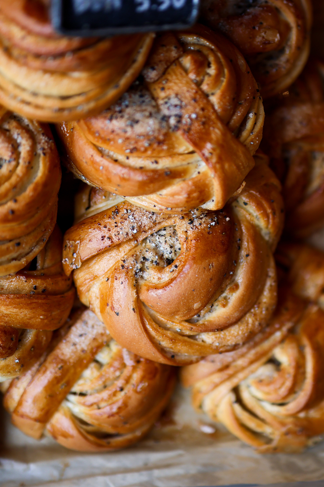

The cardamom bun is very similar to the classic cinnamon bun, and a good alternative to those who don’t like their buns too sweet. It has been a classic in Swedish bakeries for a long time, and now its popularity is spreading like wildfire to the rest of Scandinavia. Maybe the UK is next? 

## Ingredients

* 4 tablespoons butter 
* 2 tablespoons sugar
* 1 tablespoon cardamom 

## Method

1. Follow the Basic Dough recipe step 1-4. Then return to this. 
2. Mix the butter and sugar together in a bowl with a fork or spoon until it is soft.
3. Spread the filling onto the flattened dough so it covers the surface. Smear it out until it is even.
4. Sprinkle cardamom over the filling so it covers the dough in a thin layer. 
5. Fold the dough in two and cut it into bands with a width of about 2 cm. Twine and tie each band into a knot.
6. Put the cardamom buns onto a baking sheet and let them rest for an hour.
7. Brush the buns with lukewarm milk and put them on a baking tray.
8. Bake in the middle of the oven on 230℃ fan for 10-12 minutes. Let the buns cool on a cooling rack for 10-15 minutes. Enjoy!