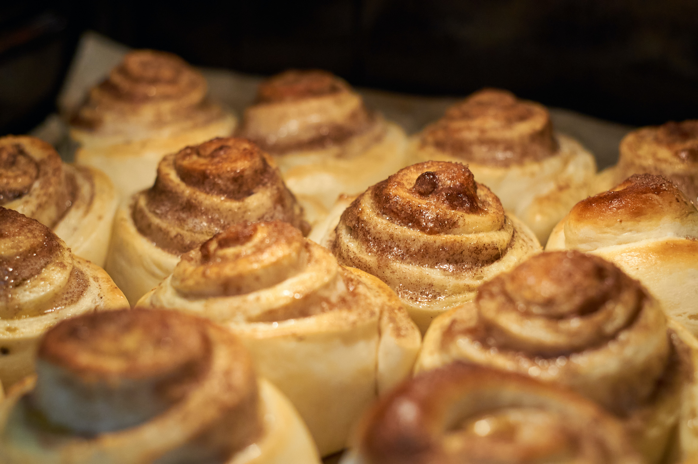

The cinnamon bun has become the number one sweet staple in the Scandinavian baking scene. A simple swirl or a complicated knot, pearl sugar or icing, the ways to customise this tasty favourite are endless. Personally, I like it fresh, warm and simple. 

## **Ingredients for filling**

* 4 tablespoons butter 
* 2 tablespoons sugar
* 1 tablespoon cinnamon
* 1 tablespoon wheat flour

## Method

1. Follow the basic dough recipe until step 4, then proceed to this.
2. Wait for the butter to be room temperature, then mix everything together in a bowl with a spoon until it is soft. 
3. Spread the filling onto the flattened dough so it covers the surface. Smear it out until it is even. 
4. Cut the dough into equal bands with a width of 2 cm. Roll the bands to create the swirl, or twine and tie them into a knot.
5. Put the swirls on a baking tray and let them rest for an hour.
6. Paint the swirls with lukewarm milk. Put them in the middle of the oven at 230℃ fan, for 10-12 minutes, until they are a nice golden brown. Take them out of the oven and let them cool down on a cooling rack. Enjoy!

