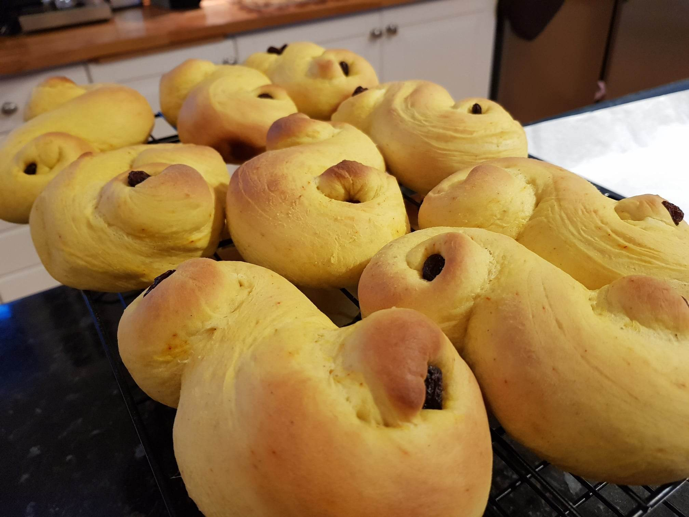

Lucia day, the 13th of December, starts early in the pitch black morning with children in kindergardens and primary schools all over Sweden and Norway are dressed in white robes, lighting up the hallways and singing about St Lucia who fed and brought joy to prisoners in Sicily hundreds of years ago (and was ultimately burned at the stake). The children will hold baskets brimming with homemade Lucia buns, giving them out to anyone they pass on their way. Yellow with safron, they are the colour of candlelight. And personally, I think the most fun part of making them is being creative with the shapes.

## **Ingredients**

* 150 g butter
* 1,5 litres milk
* 1 pack of yeast
* 1,5 dl sugar
* 2 teaspoons powdered cardamom
* 1,5 g safran 
* 0,5 teaspoons salt
* 850 g wheat flour
* Raisins for decoration

## Method

1. Melt the butter and add lukewarm milk. The liquid should be 37℃. Mix the yeast into the liquid mix until it dissolves. 
2. Mix the safran with the flour, salt, sugar and cardamom. Mix the liquid into the mixture and work with the dough, use a food processor if you have one, until the dough is even and does not stick to the sides of the bowl. Add a bit of flour if necessary. Let the dough rise until it is doubled in size. 
3. Divide the dough into 16 or 24 equal pieces, depending on if you want bigger or smaller buns. Add flour onto a clean work surface and roll the dough into sausages with a diameter of about 2 centimetres. Shape the sausages into the traditional S-shapes, or be as creative as you want! Stick raisins into the dough for decoration. 
4. Paint the buns with lukewarm milk. Put them in the middle of the oven and bake for ca. 10 minutes on 220℃ fan. 
5. Put them on a cooling rack for about 15 minutes. Enjoy!

