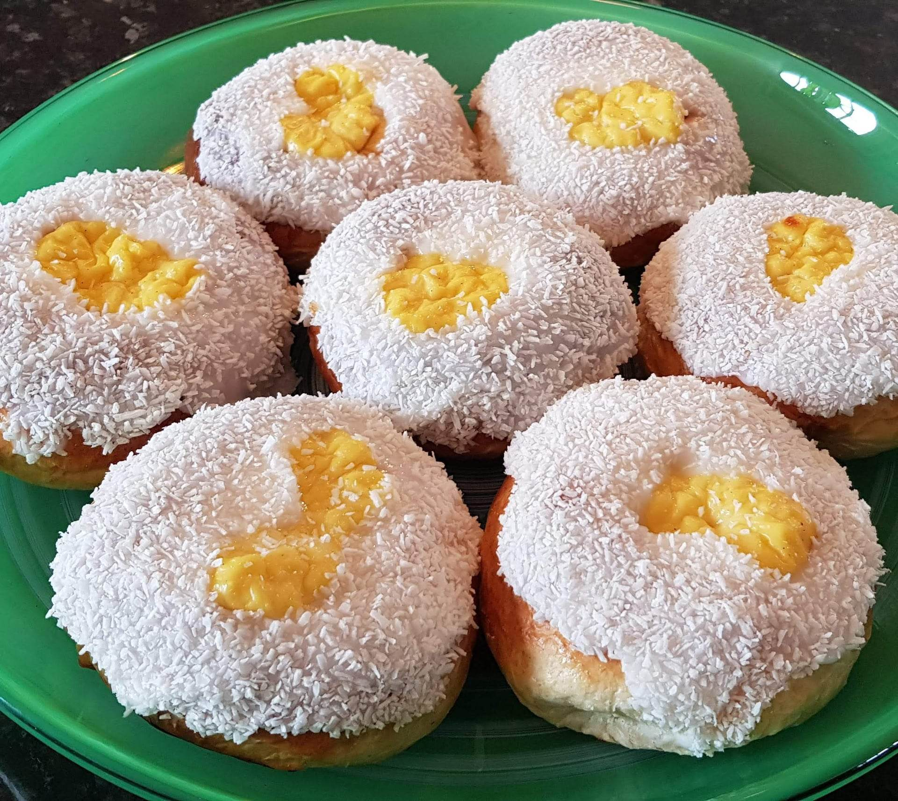

# Skolebolle (School buns)

My personal favourite! The skolebolle, or school bun if one transliterates it, is a sweet, delicious treat perfect for a sunny Sunday afternoon. The vanilla custard filling combined with the coconut icing is sure to make your mouth water and is luckily very easy to make.

## Ingredients

* Vanilla custard (chilled)
* Powdered sugar
* Desiccated coconut
* Water

## Method

1. Follow the instructions for the Basic Dough recipe steps 1-5, then return. 
2. Use a spoon to press into the bun from above to make a scoop shape, like a tiny bowl in the bun.
3. Add about one tablespoon of vanilla custard cream into the dent you created in the bun.
4. Let them rest on a baking sheet for an hour. 
5. Brush them with lukewarm milk. Put them in the middle of the oven at 230℃ fan, for ca. 10 minutes, until they are a nice golden brown. Take them out of the oven and let them cool down.